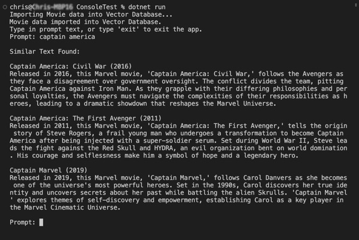

# Build5Nines SharpVector is a simple in-memory Vector Database for C# Applications

Vector databases are used with Generative AI solutions augmenting the LLM (Large Language Model) with the ability to load additional context data with the AI prompt using the RAG (Retrieval-Augmented Generation) design pattern.

While there are lots of large databases that can be used to build Vector Databases (like Azure CosmosDB, PostgreSQL w/ pgvector, Azure AI Search, Elasticsearch, and more), there aren't many options for a light weight, simple solution to embed into any .NET application.

The Build5Nines SharpVector project provides a simple, small, easy to embed, in-memory Vector Database for use in any .NET application.

The vector algorithm currently used in the `Build5Nines.SharpVector.MemoryVectorDatabase` class is based on TF-IDF (Term Frequency-Inverse Document Frequency) combined with cosine similarity for searching similar texts.

### Nuget Package

### Sample Console App

The [sample console app](src/ConsoleTest/) in this repo show example usage of Build5Nines.SharpVector.dll

It loads a list of movie titles and descriptions from a JSON file, then allows the user to type in prompts to search the database and return the best matches.

Here's a screenshot of the test console app running:

### Maintained By

The [Build5Nines](https://build5nines.com) SharpVector project is maintained by [Chris Pietschmann](https://pietschsoft.com), Microsoft MVP, HashiCorp Ambassador.
