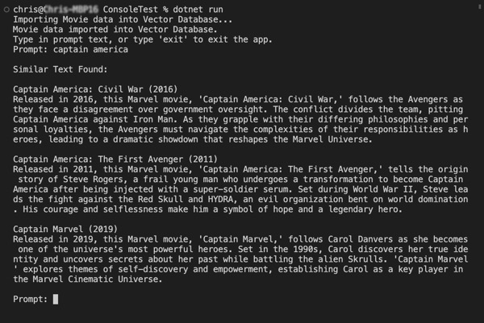

# Samples

## Sample Console App

The sample console app in this repo show example usage of `Build5Nines.SharpVector`.

It loads a list of movie titles and descriptions from a JSON file, then allows the user to type in prompts to search the database and return the best matches.

[View Source](https://github.com/Build5Nines/SharpVector/blob/main/src/ConsoleTest/Program.cs)

Here's a screenshot of the test console app running:

## Generative AI + RAG + ONNX Model

This example takes a [ONNX](https://onnxruntime.ai/docs/get-started/with-csharp.html) Generative AI app and extends it to implement Retrieval Augmented Generation (RAG) using `Build5Nines.SharpVector`.

[View Source](https://github.com/Build5Nines/SharpVector/blob/main/samples/genai-rag-onnx/Program.cs)

Read the "[Build a Generative AI + RAG App in C# with Phi-3, ONNX, and SharpVector
](https://build5nines.com/build-a-generative-ai-rag-app-in-c-with-phi-3-onnx-and-sharpvector/)" article for a detailed explanation of building this sample app.
